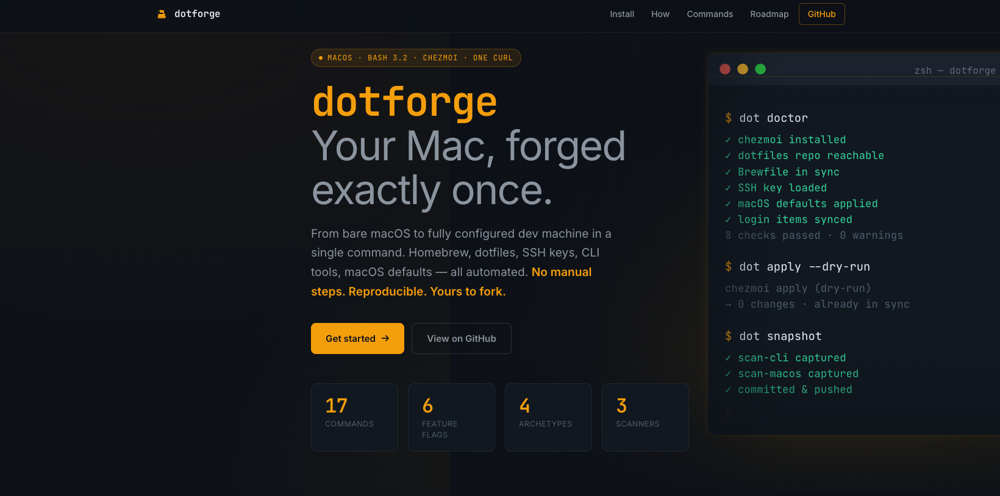

<p align="center">
  <a href="https://roman-dubovik.github.io/dotforge/">
    
  </a>
</p>

<p align="center">
  <strong>🔨&nbsp;<a href="https://roman-dubovik.github.io/dotforge/">roman-dubovik.github.io/dotforge</a></strong>
  &nbsp;·&nbsp;
  <a href="#install">Install</a>
  &nbsp;·&nbsp;
  <a href="#quick-start">Quick start</a>
  &nbsp;·&nbsp;
  <a href="#commands">Commands</a>
  &nbsp;·&nbsp;
  <a href="ROADMAP.md">Roadmap</a>
  &nbsp;·&nbsp;
  <a href="CHANGELOG.md">Changelog</a>
</p>

<p align="center">
  <em>Opinionated Mac bootstrap. One curl from bare macOS to a fully configured dev machine.<br>
  Homebrew, dotfiles, SSH keys from Bitwarden, macOS defaults — all reproducible, all in git.</em>
</p>

---

# dotforge

```bash
curl -fsSL https://raw.githubusercontent.com/roman-dubovik/dotforge/main/docs/install.sh | bash
```

macOS only · bash 3.2+ · chezmoi · Bitwarden · Homebrew

---

## What's new (May 2026)

Shipped in slices 2c, 2d, 2e, and Plan 3 MVP:

- **`dot apply --enable/--disable`** — toggle feature flags from the CLI, persist to
  `~/.config/dotforge/state.toml`, sync to `chezmoi.toml`, then apply. Example:
  `dot apply --disable=office_suite,media_tools`.
- **`dot features`** — list all six feature flags with current values and source
  (`state.toml` / `chezmoi.toml` / `default`), and whether the two sources are in sync.
- **`dot apply`** — runs `chezmoi apply`, then prints a before/after doctor delta so you see exactly
  what changed. Accepts `--dry-run` to preview without touching the filesystem.
- **`dot snapshot`** — captures the current state of CLI globals, login items, and macOS defaults
  into tracked files and commits them automatically.
- **`dot pull --resolve=ours|theirs|interactive`** — non-destructive multi-machine reconciliation.
  Default (`abort`) is unchanged. `ours`/`theirs` stash local changes, merge, auto-resolve conflicts,
  restore stash. `interactive` prompts per-file.
- **`dot status`** — read-only divergence report: ahead/behind counts vs origin, working tree
  cleanliness, uncommitted scanner outputs, and `dot doctor` summary. Exit 0 if in-sync, 1 if any
  divergence. Use `--fetch` to update remote refs first.
- **`dot pull`** — fetches the repo, fast-forwards, applies, and runs `dot doctor` to
  surface any drift immediately (no diff shown — use `dot apply` for before/after delta).
- **Feature flags** — six toggles (`docker_desktop`, `ai_assistants`, `vpn_suite`, `office_suite`,
  `media_tools`, `design_tools`) declared in `chezmoi/.chezmoi.toml.tmpl`. The Brewfile regenerates on every
  `chezmoi apply` based on the flags that are on.
- **`scan-macos --capture`** — snapshots current `defaults read` output into a tracked file, so your
  macOS settings round-trip through git.
- **bats test suite** — smoke tests for doctor, apply, snapshot, pull, and feature-flag templating.

---

dotforge is a shell-based Mac provisioning system built around chezmoi for dotfiles, Homebrew for
packages, and Bitwarden for secrets. It is not a general-purpose dotfiles manager and not trying to
be nix-darwin or Ansible. The scope is deliberate: one person, macOS, opinionated defaults.

Compared to chezmoi alone: dotforge adds Brewfile archetypes, Bitwarden-backed SSH distribution,
macOS system defaults, login-item provisioning, and a `dot` CLI for ongoing sync and drift detection.
Compared to nix-darwin: less reproducibility, much shallower learning curve — a shell script you can
read in an afternoon. See [Adjacent tools](#adjacent-tools) for a full comparison grid.

---

## Install

### New Mac (curl)

```bash
curl -fsSL https://raw.githubusercontent.com/roman-dubovik/dotforge/main/docs/install.sh | bash
```

The installer checks for macOS, installs Xcode Command Line Tools if absent, installs Homebrew,
clones the repo to `~/dotforge` (or `$DOTFORGE_INSTALL_DIR`), and runs `bootstrap.sh setup`.
It is idempotent: a second run does `git pull --ff-only` and re-applies rather than cloning on top.

Environment overrides:

```bash
DOTFORGE_REPO_URL=https://github.com/your-fork/dotforge \
DOTFORGE_BRANCH=main \
DOTFORGE_INSTALL_DIR=~/my-dotforge \
  curl -fsSL ... | bash
```

### Existing repo (manual)

```bash
git clone https://github.com/roman-dubovik/dotforge ~/dotforge
cd ~/dotforge
./bootstrap.sh setup
```

After the first install, `dot setup` is also available as a shorter alias (see [Commands](#commands)).

### Verify

```bash
dot doctor
```

All eight checks should pass. Exit code 0 = clean, 1 = warnings, 2 = failures.

### Uninstall

No one-command uninstall — undoing `chezmoi apply` on a live machine is risky. Manual steps:

```bash
chezmoi forget --all         # stop tracking dotfiles
chezmoi remove               # optional: delete managed files from $HOME
rm -rf ~/dotforge            # remove the repo
rm ~/.local/bin/dot          # remove the CLI shim
```

Homebrew packages are not removed automatically — run `brew bundle cleanup` against an empty Brewfile
if you want them gone.

---

## Quick start

`bootstrap.sh setup` is an interactive wizard. It installs dependencies, prompts for machine-specific
choices, and runs `chezmoi apply` at the end.

Sample session on a fresh Mac:

```
dotforge — Mac bootstrap setup

→ Checking prerequisites…
  ✓ Xcode Command Line Tools
  ✓ Homebrew 4.5.1
  ✓ chezmoi 2.60.2

? Machine name [MacBook-Pro]:  work-mbp
? Profile (personal / work) [personal]:  work
? Brewfile archetype:
    1. full         — everything: GUI apps, AI tools, media, design
    2. minimal-dev  — CLI tools only, no heavy GUI apps
    3. cli-server   — headless: git, brew essentials, no GUI
    4. custom       — hand-pick sections interactively
  Choice [1]:  2

? Feature flags (press Enter to keep defaults):
    docker_desktop   [on]:
    ai_assistants    [on]:
    vpn_suite        [on]:
    office_suite     [off]:
    media_tools      [on]:  off
    design_tools     [on]:  off

→ Initialising chezmoi…
→ Installing Homebrew packages (Brewfile)…
→ Installing curl toolchains (oh-my-zsh, p10k, nvm, pnpm, maestro)…
→ Pulling SSH keys from Bitwarden (item: dotforge-ssh-work)…
→ Applying macOS system defaults…
→ Configuring login items and LaunchAgents…
→ Installing dot CLI to ~/.local/bin/dot…

✓ Bootstrap complete. Run 'dot doctor' to verify.
```

---

## How it works

```text
curl install.sh | bash
        │
        ▼
bootstrap.sh setup
        │
        ▼
chezmoi init + apply
        │
        ├──────────────────────────────────────────────────────────────┐
        │                                                              │
        ▼                                                              ▼
run_onchange_20-apply-brewfile          run_once_before_10-install-bw
        │                                        │
        ▼                                        ▼
brew bundle (Brewfile + Brewfile.local)   Bitwarden CLI install
                                                 │
        ┌────────────────────────────────────────┘
        │
        ├─→ run_onchange_25-install-curl-toolchains  (oh-my-zsh, p10k, nvm, pnpm, maestro)
        ├─→ run_onchange_30-install-cli-globals       (npm/pnpm/cargo/go/pip globals)
        ├─→ run_onchange_50-pull-ssh-keys             (Bitwarden → ~/.ssh/)
        ├─→ run_onchange_60-apply-macos-defaults      (defaults write, ~40 keys)
        └─→ run_onchange_70-apply-login-autostart     (login items + LaunchAgents)
                                                              │
                                                              ▼
                                                  dot CLI → ~/.local/bin/dot
                                                              │
                                         ┌────────────────────┼────────────────────┐
                                         ▼                    ▼                    ▼
                                    dot doctor           dot apply           dot snapshot
                                    (8 checks)     (apply + delta)    (capture + commit)
                                                              │
                                                              ▼
                                                         dot pull
                                                  (fetch + ff + apply + doctor)
```

---

## Commands

Full reference for all dotforge entry points.

| Layer | Subcommand | What it does |
|---|---|---|
| `bootstrap.sh` | `setup` | Full Mac bootstrap: Xcode CLT, Homebrew, chezmoi init, prompts, chezmoi apply |
| `bootstrap.sh` | `update` | `chezmoi update -v` — fetches source repo and applies dotfiles atomically |
| `bootstrap.sh` | `sync` | Promote locally-installed brew packages and `/Applications` into the canonical Brewfile |
| `bootstrap.sh` | `customize` | Interactive Brewfile section picker; re-runs feature flag prompts |
| `bootstrap.sh` | `add-key` | Encrypt and upload SSH keys to Bitwarden (bulk or single key) |
| `bootstrap.sh` | `scan-cli` | Classify everything on PATH; print or capture to `cli-globals.txt` |
| `bootstrap.sh` | `scan-macos` | Print current macOS System Settings as `defaults write` commands; `--capture` writes to tracked file |
| `bootstrap.sh` | `scan-autostart` | Dump current login items + LaunchAgents survey |
| `bootstrap.sh` | `doctor` | Identical to `dot doctor` — 8 read-only checks |
| `bootstrap.sh` | `fork` | Clone + personalize this repo under your own GitHub account |
| `bootstrap.sh` | `browse` | Read-only interactive walkthrough of what bootstrap does |
| `dot` | `setup` | Alias for `bootstrap.sh setup` — available after first install |
| `dot` | `doctor` | 8 read-only sync checks; exit 0/1/2 |
| `dot` | `apply` | `chezmoi apply` + before/after doctor delta; accepts `--dry-run`, `--enable=FEATURE`, `--disable=FEATURE` |
| `dot` | `features` | List all feature flags with current values and source (`state.toml` / `chezmoi.toml` / `default`) |
| `dot` | `snapshot` | `scan-cli --capture` + `scan-login-autostart --capture` + `scan-macos --capture` → auto-commit |
| `dot` | `status [--fetch]` | Non-destructive divergence report: ahead/behind, working tree, uncommitted scanner files, doctor summary. Exit 0 = in-sync, 1 = diverged |
| `dot` | `pull [--resolve=abort\|ours\|theirs\|interactive]` | Fetch + merge + `chezmoi apply` + `dot doctor`. Default (`abort`) = ff-only. `ours`/`theirs`/`interactive` handle merge conflicts |
| `dot` | `version / help` | Print version hash + branch, or show usage |

---

## Feature flags

Declared in `chezmoi/.chezmoi.toml.tmpl` under `[data.features]`. The Brewfile template reads these
flags and regenerates `Brewfile.local` on every `chezmoi apply`.

| Flag | Default | What it gates |
|---|---|---|
| `docker_desktop` | on | Docker Desktop GUI app |
| `ai_assistants` | on | Claude, ChatGPT, Copilot-related desktop apps |
| `vpn_suite` | on | VPN client (Wireguard, Tailscale, or corp VPN) |
| `office_suite` | **off** | Microsoft Office / LibreOffice |
| `media_tools` | on | Spotify, VLC, media utilities |
| `design_tools` | on | Figma, image/video editing apps |

### Programmatic toggles (Slice 2e)

Feature flag state is persisted to `~/.config/dotforge/state.toml` and kept in sync with
`~/.config/chezmoi/chezmoi.toml`. Use `dot apply` to toggle flags from the CLI:

```bash
# Enable a flag and apply immediately
dot apply --enable=docker_desktop

# Disable one or more flags (comma-separated CSV or repeated)
dot apply --disable=office_suite,media_tools

# Mixed: enable one, disable another, then apply
dot apply --enable=office_suite --disable=media_tools

# Inspect current values, sources, and sync status
dot features
```

`dot features` shows the value for each flag, where it comes from (`state.toml`,
`chezmoi.toml`, or compiled-in `default`), and whether the two sources are `in-sync` or
`DIVERGENT`.

The Brewfile regenerates automatically on every `chezmoi apply`; packages no longer needed are not
removed automatically — run `brew bundle cleanup` if you want them uninstalled.

---

## Archetypes

Chosen during `bootstrap.sh setup` (or `bootstrap.sh customize`), persisted as
`brewfile_archetype` in `~/.config/chezmoi/chezmoi.toml`.

| Archetype | Use case | Included |
|---|---|---|
| `full` | Personal Mac, daily driver | All brew formulae and casks; all feature flags respected |
| `minimal-dev` | Focused development machine | CLI tools + dev apps; no heavy GUI, no media/design |
| `cli-server` | Headless or remote Mac | Core brew formulae only; no GUI casks |
| `custom` | Hand-picked | Interactive section picker; enables exactly what you select |

---

## Scanners

Three read-only scanners capture the current state of a Mac and write it into tracked files.

| Scanner | Invocation | Output file |
|---|---|---|
| `scan-cli` | `bootstrap.sh scan-cli --capture` | `cli-globals.txt` |
| `scan-autostart` (script: `scan-login-autostart.sh`) | `bootstrap.sh scan-autostart --capture` | `login-items.txt` |
| `scan-macos-defaults` | `bootstrap.sh scan-macos --capture` | `chezmoi/dot_config/dotforge/macos-defaults.txt` |

`dot snapshot` calls all three in sequence and commits the result. The files are chezmoi-managed, so
the next `chezmoi apply` on any machine will replay the captured state.

---

## chezmoi hooks

chezmoi runs these scripts automatically on `chezmoi apply`. Scripts named `run_onchange_*` only
re-execute when their content changes (or when a template input changes); the `run_once_before_*`
script runs once per machine lifetime.

| Hook file | Trigger | What it does |
|---|---|---|
| `run_once_before_10-install-bw.sh` | Once (first apply) | Installs Bitwarden CLI, yq, and jq via Homebrew |
| `run_onchange_20-apply-brewfile.sh.tmpl` | Brewfile or flags change | Runs `brew bundle`; generates `Brewfile.local` from archetype + feature flags |
| `run_onchange_25-install-curl-toolchains.sh` | Script content changes | Installs oh-my-zsh, powerlevel10k, zsh plugins, nvm + Node LTS, pnpm, maestro |
| `run_onchange_30-install-cli-globals.sh.tmpl` | `cli-globals.txt` changes | Replays npm/pnpm/cargo/go/pip global packages |
| `run_onchange_50-pull-ssh-keys.sh.tmpl` | SSH config template changes | Fetches SSH keys from Bitwarden; writes to `~/.ssh/` |
| `run_onchange_60-apply-macos-defaults.sh.tmpl` | Defaults file changes | Applies ~40 `defaults write` keys across Dock, Finder, Keyboard, Trackpad, Screenshots, Safari |
| `run_onchange_70-apply-login-autostart.sh` | `login-items.txt` changes | Configures login items via `osascript`; loads custom LaunchAgents from `~/Library/LaunchAgents/` |

---

## Cross-machine sync

dotforge supports multiple Macs through git. Each machine runs its own `chezmoi apply` against the
same repo; machine-specific differences live in chezmoi templates (profile, machine name, feature
flags) rather than branching the repo.

```text
Mac A (work-mbp)                        Mac B (home-mini)

dot snapshot                            dot snapshot
     │                                       │
     ▼                                       ▼
git push ──────────────────────────────→ git pull
                                             │
                                             ▼
                                        dot pull
                                  (fetch + ff + apply + doctor)
```

SSH keys are scoped per profile: `dotforge-ssh-personal` for personal Macs, `dotforge-ssh-work`
for corporate machines. The `run_onchange_50-pull-ssh-keys.sh.tmpl` hook fetches the right set based
on the profile in `chezmoi.toml`.

### Conflict resolution (`dot pull --resolve`)

When two machines diverge (both ran `dot snapshot` and pushed), use `dot pull --resolve=<mode>` to
merge instead of aborting:

```bash
dot status                     # check what's ahead/behind before pulling
dot pull --resolve=ours        # keep local changes on conflict
dot pull --resolve=theirs      # take remote changes on conflict
dot pull --resolve=interactive # prompt per-conflicted file
```

Flow for `ours`/`theirs`: local uncommitted changes are stashed → merge is attempted → conflicts
resolved automatically → `chezmoi apply` runs → stash is popped. On any failure the stash is
restored with an explicit message so nothing is lost.

Full three-way merge is Plan 3 future work; current MVP covers the common case of
content-append conflicts on scanner output files.

---

## Feature matrix

| Feature | Status | Notes |
|---|---|---|
| Xcode CLT install | ✅ shipped | Plan 1 |
| Homebrew install + Brewfile | ✅ shipped | Plan 1 |
| chezmoi dotfiles (`.zshrc`, `.gitconfig`, `~/.ssh/config`) | ✅ shipped | Plan 1 |
| SSH keys via Bitwarden | ✅ shipped | Plan 1 |
| `bootstrap.sh fork` (personalize for own account) | ✅ shipped | Plan 1 |
| curl-toolchains (oh-my-zsh, p10k, nvm, pnpm, maestro) | ✅ shipped | Plan 1.5 |
| macOS defaults baseline (~40 keys) | ✅ shipped | Plan 1.5 |
| `scan-macos` subcommand | ✅ shipped | Plan 1.5 |
| `bootstrap.sh doctor` (8 checks) | ✅ shipped | Slice 1 |
| `dot` CLI namespace (chezmoi-managed shim) | ✅ shipped | Slice 2a |
| Brewfile archetypes (4 options) | ✅ shipped | Slice 2b |
| `dot apply` + dry-run | ✅ shipped | Slice 2c |
| `dot snapshot` | ✅ shipped | Slice 2c |
| `dot pull` | ✅ shipped | Slice 2c |
| Feature flags (6) | ✅ shipped | Slice 2d |
| `scan-macos --capture` | ✅ shipped | Slice 2d |
| bats test suite | ✅ shipped | Slice 2d |
| `dot setup` alias | ✅ shipped | Public launch |
| curl installer (`docs/install.sh`) | ✅ shipped | Public launch |
| GitHub Pages landing (`docs/index.html`) | ✅ shipped | Public launch |
| `dot apply --enable=X --disable=Y` (programmatic flag toggle) | ✅ shipped | Slice 2e |
| Persistent bootstrap menu | ✅ shipped | Slice 2e |
| `dot status` (divergence report) | ✅ shipped | Plan 3 MVP |
| `dot pull --resolve=ours/theirs/interactive` (conflict resolution) | ✅ shipped | Plan 3 MVP |
| Full three-way merge | 📅 planned | Plan 3 future |
| App-specific config restore (Raycast, VS Code, JetBrains, iTerm) | 📅 planned | Plan 3+ |
| Browser extensions, mail accounts, app subscriptions | 📅 out of scope | Apple platform constraints |

---

## Limitations & honesty

**Static, not dynamic.** dotforge applies a snapshot of configuration. It does not watch for
drift and it does not automatically re-apply when settings change. Run `dot doctor` to check state,
`dot apply` to re-apply.

**macOS only.** There is no Linux support and no Windows support. These are not planned.
The bootstrap assumes Darwin; the installer exits immediately on any other OS.

**Bitwarden is required for SSH keys.** If you do not use Bitwarden, you will need to distribute
SSH keys manually and skip or modify `run_onchange_50-pull-ssh-keys.sh.tmpl`. There is no 1Password,
Keychain, or other secrets store integration.

**No full app-settings restore.** Installed apps are tracked; their configuration is not. The
following are out of scope for the foreseeable future because the Apple platform does not provide a
reliable programmatic path:

- Raycast extensions and settings
- VS Code / Cursor extensions and user settings (the JSON files can be tracked; extensions cannot)
- JetBrains plugin lists and IDE settings
- iTerm2 / Warp / Ghostty profiles
- Hammerspoon, Rectangle, BetterDisplay configuration
- Browser extensions and signed-in sessions
- App Store subscriptions and in-app logins

**Feature flag changes do not uninstall packages.** Toggling a flag off and running `dot apply`
will stop installing the associated packages in the future. Packages already on disk remain. Run
`brew bundle cleanup` if you want them removed.

**`run_onchange_*` scripts re-run on content change, not on state.** If a script fails halfway
through, chezmoi considers it not-yet-run and will retry on next apply. If it succeeds but you later
uninstall what it installed, chezmoi will not re-run it until the script content changes.

---

## Adjacent tools

If dotforge doesn't fit, these are the honest alternatives:

| Tool | What it does | When to prefer it |
|---|---|---|
| **[chezmoi](https://chezmoi.io)** | Dotfiles manager with templating and secrets backends | You only need dotfiles managed, not full Mac provisioning |
| **[nix-darwin](https://github.com/LnL7/nix-darwin)** | Declarative macOS configuration via Nix | You want full reproducibility, rollback, and a functional approach; steeper learning curve |
| **[dotbot](https://github.com/anishathalye/dotbot)** | Symlink manager + task runner via YAML config | You want a simpler, more configurable approach without the chezmoi template DSL |
| **[mackup](https://github.com/lra/mackup)** | Backs up and restores app settings via cloud storage | You care primarily about app settings (not packages or system config) |
| **[Ansible](https://github.com/ansible/ansible)** | General-purpose automation with Mac support | You need to manage multiple machines centrally, prefer idempotent YAML playbooks |

dotforge is closest to "chezmoi + Homebrew + a shell orchestrator." If you are already happy with
chezmoi and just missing the Brewfile and macOS-defaults pieces, you might get 80% of the value by
writing a small wrapper yourself rather than adopting the full dotforge opiniation.

---

## Using this for your own Mac

dotforge is designed to be forked and personalized.

```bash
curl -fsSL https://raw.githubusercontent.com/roman-dubovik/dotforge/main/bootstrap.sh | bash -s -- fork
```

`bootstrap.sh fork` clones the repo and runs `scripts/personalize-fork.sh`, which replaces:

- `roman-dubovik/dotforge` → your GitHub repo path
- `Roman Dubovik` → your name
- `booroman@gmail.com` → your email
- `id_ed25519_github_booroman` → your SSH key name (optional, `--reset-ssh`)

It walks through each change with confirmation prompts and offers to create the new GitHub repo and
push.

**Manual edits after fork:** work-profile git email in `chezmoi/dot_gitconfig.tmpl`; Bitwarden item
names in `run_onchange_50-pull-ssh-keys.sh.tmpl` if you rename them; Brewfile sections via
`bootstrap.sh customize`.

---

## Development

No build step. Scripts are plain bash; edit and test directly.

```bash
git clone https://github.com/roman-dubovik/dotforge ~/dotforge
bash -n bootstrap.sh              # syntax check
bash -n scripts/doctor.sh
bash -n docs/install.sh
```

**Tests** (requires `brew install bats-core`):

```bash
bats tests/
```

Covers `dot doctor`, `dot apply --dry-run`, `dot snapshot`, `dot pull`, and feature-flag Brewfile
templating; runs in a sandboxed fixture in `$TMPDIR`.

**Adding a feature flag:** add to `chezmoi/.chezmoi.toml.tmpl` under `[data.features]`; add a
conditional block to `chezmoi/Brewfile.tmpl`; update the flags table in this README; add a bats test.

**Updating canonical state:**

```bash
bootstrap.sh scan-cli       # see what's new in PATH
bootstrap.sh sync           # promote newly-installed packages into Brewfile
```

See [CHANGELOG.md](./CHANGELOG.md) for per-slice history and [ROADMAP.md](./ROADMAP.md) for
planned work.

---

## License

MIT — see [LICENSE](./LICENSE).
